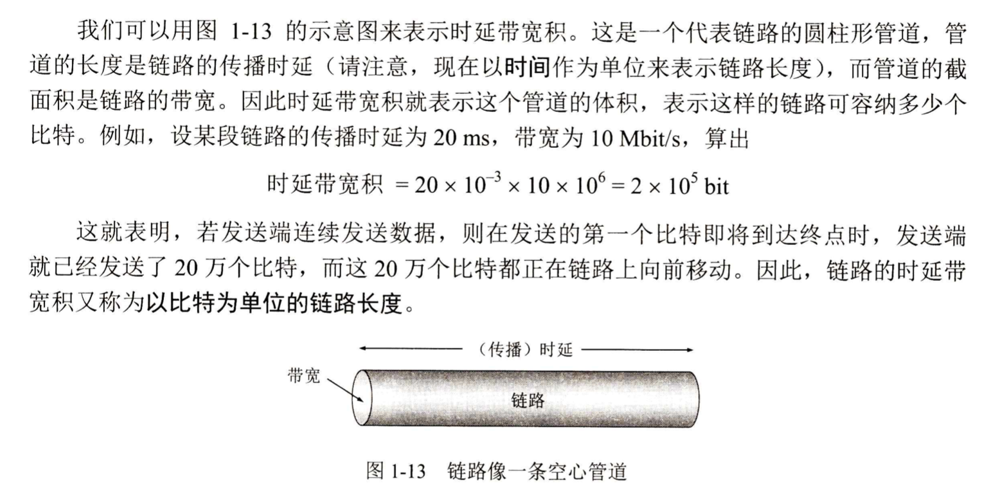

# 概述

## 計算機網絡的作用

三類網絡：電信網絡，有線電視網絡，計算機網絡

Internet：數量極大的各種計算機網絡互聯而成，覆蓋全球

兩大基本特性：聯通性、共享(資源共享)

互聯網+：融合互聯網成果到經濟社會各個領域中

## 互聯網概述

計算機網絡由若干節點和連結這些節點的鏈路組成。

節點：計算機、集線器、交換機、路由器

網絡 VS 互聯網：網絡連接多個計算機，互聯網連接網絡

### 互聯網三個階段

#### 單個網絡APPANET -> 互聯網

1969，usa國防部，第一個分組交換網APPANET。

1983年，互聯網誕生。

1990，APPANET宣佈關閉。

#### 三級結構

主幹網，地區網，校園網

#### 全球範圍多層次ISP結構的互聯網

互聯網服務提供商ISP，互聯網交換點IXP(連接地區性ISP，減少交換時間)

## 互聯網組成

邊緣部分(用戶直接使用) + 核心部分(為邊緣部分提供服務)

### 邊緣部分

端系統：連接在互聯網上的所有主機

端系統通信：客戶-服務器C/S方式，對等P2P方式

C/S：最常見最傳統，客戶是服務請求方，服務器是服務提供方。

P2P：兩台主機都運行對等連接軟件

### 核心部分

核心部分起特殊作用：路由器，轉發收到的分組

交換：按照某方式動態分配傳輸線路的資源

電路交換：建立連接 -> 通話(兩個用戶始終佔用端到端資源) -> 釋放連接，傳輸效率低

分組交換：存儲轉發技術，把發送的整塊數據叫做報文。數據段+首部=分組/包。路由器用來轉發分組，進行分組交換。

## 計算機網絡類別

廣域網WAN，城域網MAN，局域網LAN，個人區域網PAN

公用網，專用網

接入網

## 計算機網絡性能

速率 b/s bps 比特每秒，k = 103，M = 106，G = 109，T = 1012， P = 1015，E = 1018，Z = 1021

帶寬 bit/s 比特每秒 單位時間內網絡中某信道能通過的最高數據率

吞吐量 單位時間內通過某個網絡的實際數據量

### 時延

#### 發送時延

主機或路由器發送數據幀所需要的時間，也叫傳輸時延。

發送時延 = (數據幀長度bit) / (發送速率bit/s)

#### 傳輸時延

傳播時延 = (信道長度m) / (電磁波在信道上的傳播速率m/s)

#### 處理時延

#### 排隊時延

### 時延帶寬積

以比特為單位的鏈路長度

時延帶寬積 = 傳播時延 * 帶寬

### 往返時間RTT

發送時間 = 數據長度 / 發送速率

有效數據率 = 數據長度 / (發送時間 + RTT)

### 利用率

D = D0 / (1 - U)

D0網絡空閒時的時延，D網絡當前時延，U網絡利用率

信道利用率或網絡利用率越高，產生的時延越大

### 非性能特徵

費用、質量、標準化、可靠性、可擴展性和可升級性、易於管理和維護

## 網絡體系結構

開放系統互連基本參考模型OSI/RM

TCP/IP是事實上的國際標準

### 網絡協議

為進行網絡中的數據交換而建立的規則、標準或約定

組成：語法、語義、同步

分層的優勢：各層獨立、靈活性好、結構上可分割開、易於實現與維護、促進標準化工作

各層任務：差錯控制、流量控制、分段與重裝、復用和分用、連接建立和釋放。

### 體系結構

各層及其協議的集合。

TCP/IP四層結構：應用層、運輸層、網際層、鏈路層

#### 應用層

通過應用進程間的交互完成特定網絡應用，定義應用進程間通信和交互的規則。

DNS，HTTP，SMTP

交互的數據單元為報文。

#### 運輸層

進程通信間提供通用的數據傳輸服務。

傳輸控制協議TCP(報文段)，用戶數據報協議UDP(用戶數據報)

#### 網絡層

為分組交換網上不同主機提供通信服務。

#### 數據鏈路層

節點傳輸數據時，鏈路層將網絡層交下來的IP數據報組裝成幀並傳輸。幀包含數據和控制信息。

物理層

傳輸數據單位是比特。

對等層次之間傳送的數據單位是該層的協議數據單元PDU

實體：任何可發送或接收信息的硬件或軟件進程

協議：控制兩個對等實體進行通信的規則集合

下面的協議對上面的實體是透明的

服務數據單元SDU：層與層之間交換的數據的單位

