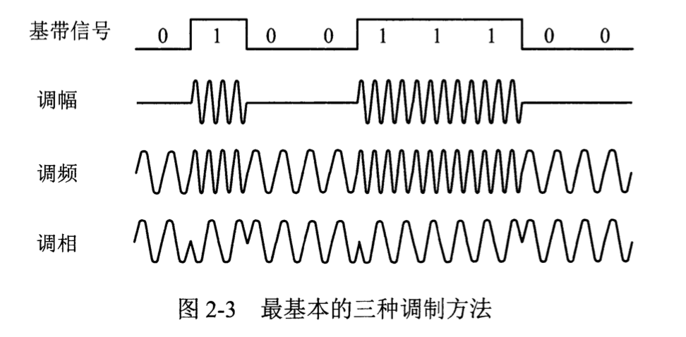
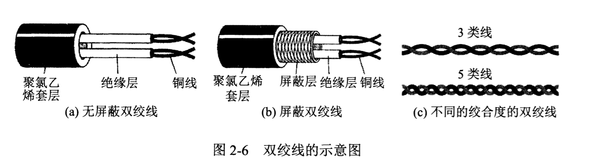
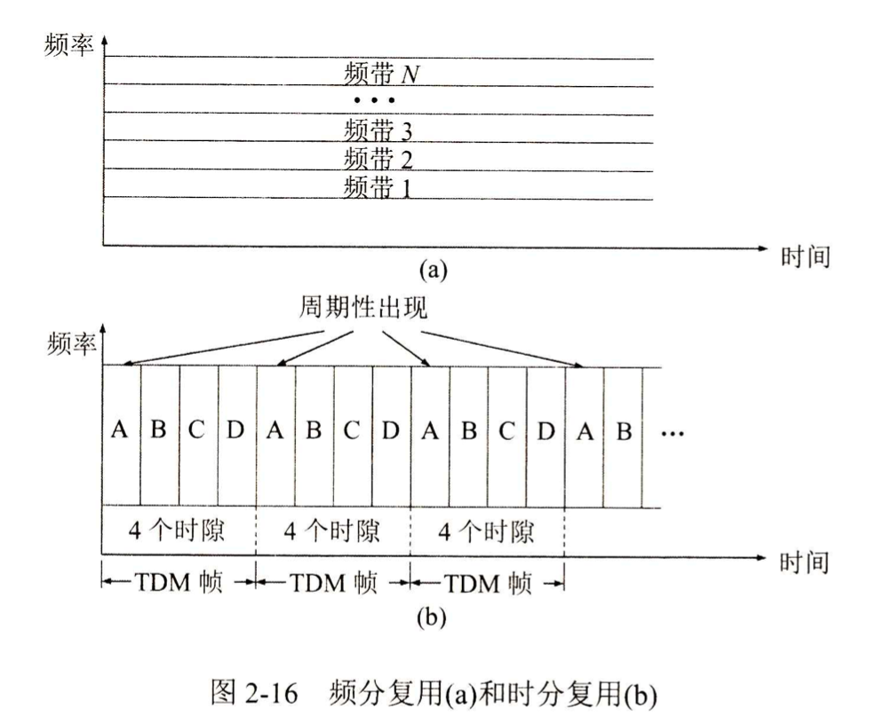
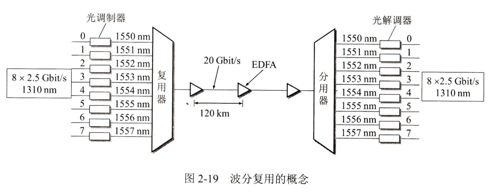

# 物理層

主要任務：在介質上傳輸比特流

四個特性：機械特性(接線器形狀與尺寸，引線數目排列...)、電氣特性(電壓範圍)、功能特性(某一電平的電壓的意義)、過程特性(不同功能的各種可能事件的意義)

## 數據通信基礎知識

### 通信模型

(輸入漢字) -> PC機 -> (數字比特流) -> 調製解調器 -> (模擬信號) -> (公用電話網) -> (模擬信號) -> 調製解調器 -> (數字比特流) -> PC機 -> (顯示漢字)

信道：向某一方向傳輸信息的介質，通信的目的是傳送消息，消息的實體是數據，信號是數據的電氣/電磁表現。

時域中代表不同離散數值的基本波形為碼元，單位時間內通過信道的碼元個數為碼元速率(波特)，單位時間內通過信道的信息量為數據速率(bps) -> 期望一個碼元攜帶盡可能多的比特

### 信號的概念

· 通信雙方的交互方式：單向通信，雙向交替通信，雙向同時通信

· 基帶信號是來自信源的信號，是計算機輸出的代表各種文件或圖像的數據信號，在物理世界中基本無法直接傳輸；帶通信號是經過基本調製的信號，可以直接傳輸

·二元製調製方法：調幅(AM)，調頻(FM)，調相(PM) -> 常採用多元調製的方式

信號失真：碼元傳輸速率越高，信號傳輸越遠，失真越嚴重。有失真但可識別。

Nyquist定理：理想低通信道最大數據傳輸率 = 2 H log2V bps

信噪比：10 log10(S / N) dB

Shannon公式：信道的極限信息傳輸速率 C=W log2(1 + S / N) b/s	W信道帶寬，S信道內信號平均功率，N信道內高斯噪聲功率

## 物理層下的傳輸介質

傳輸介質：導引型傳輸介質，非導引型傳輸介質

### 導引型傳輸介質

雙絞線：10Mbps～10Gbps，STP屏蔽雙絞線(銅網屏蔽層)，UTP無屏蔽雙絞線

同軸電纜：數十Mbps，用作導引型共享媒體，具有很好的抗干擾性

光纖通信：每個脈衝表示一個比特，數十～數百Gbps，不受電磁干擾，長途導引型傳輸媒體 (跨海鏈路)，分為單模光纖(傳輸性能更佳，光线直径=光波波长)與多模光纖

### 非導引型傳輸介質

可以傳播無線電波的空間，分為短波通信、微波通信以及衛星通信

#### 微波通信

微波：300MHz～300GHz，頻率大於100MHz的電磁波幾乎按照支線傳播，可獲得極高的信噪比

無線頻譜ISM頻段無需申請即可使用，限制發射功率小於<1Watt，促進短距離通信應用

使用ISM頻段的設備：WLAN、Blutooth、無線鼠標、無繩電話...

#### 衛星通信

通過衛星進行微波信號轉發，通信距離遠、覆蓋範圍廣、通信容量大，但是傳播時延大，地球同步衛星單向時延250-300ms

低軌道衛星在數據通信領域發展較快 SpaxeX Starlink，成本低信號衰減小時延較小

## 信道復用技術

### 頻分復用與時分復用

復用：在一個信道上傳輸多路信號

最基本的是頻分復用FDM以及時分復用TDM

頻分復用：各路信號在同樣的時間佔用不同的帶寬資源

時分復用：所有用戶在不同時間佔用同樣的頻帶寬度，每個用戶佔用一個時間片

波分復用：光的頻分復用，專門用於光纖通信

碼分復用：碼分多址，用於無線通信，將每個比特時間劃分為m個短的間隔(碼片chip)，每個站分配唯一的m bit碼片序列，個站的碼片序列必須互相正交，使用擴頻通信方法，每bit轉換成m bit碼片

· 正交：向量規格化內積為0

· 規格化內積：向量內積 / 向量長度

發送的信號有很強的抗干擾能力，類似白噪聲

## 數字傳輸系統

### 脈碼調製系統

用於電話交換系統，在數字傳輸系統中進行多路話音變換與傳輸，話音由模擬 -> 數字，對模擬話音按週期進行採樣和A/D變換

數字化的話音數據進行時分多路復用，中國使用歐洲體制E1

## 寬帶接入技術

### xDSL技術

最後一公里：通信運營局端到家庭用戶之間的本地迴路，普遍仍採用模擬傳輸方式

xDSL在不改變線路前提下，改造現有的模擬電話用戶線傳輸方式，使其能承載寬帶業務

xDSL類型：ADSL、HDSL、SDSL、VDSL

ADSL特點：使用電話線，0～4kHz低端頻譜留給電話用，高端頻譜用作網絡接入，帶寬非對稱，上下行帶寬不同，適應家庭用戶上網特點

### HFC

光纖混合同軸網，以有線電視網CATV為基礎的帶寬接入技術

· 單向廣播式傳輸 -> 雙向傳輸

· 傳輸電視信號 -> 傳輸電視、話音、數據

· 以同軸電纜為主 -> 光纖 + 同軸電纜

主幹線路採用光纖，採用節點體系結構，具有比CATV網更寬的頻譜，具有雙向傳輸功能，每個家庭要安裝一個用戶接口盒UIB

### FTTx

基於光纖傳輸的寬帶接入技術，FTTH光纖到戶

目前用於光纖到戶的技術是無源光網絡PON：EPON、GPON
