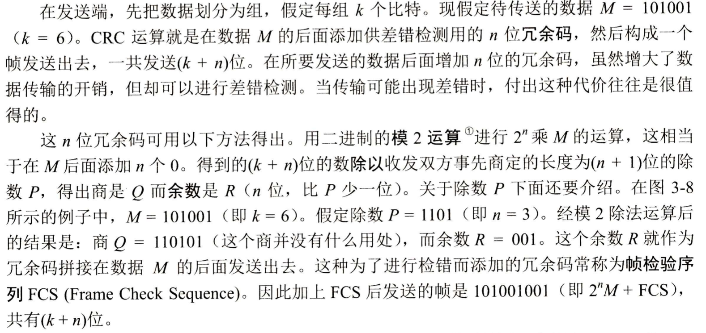
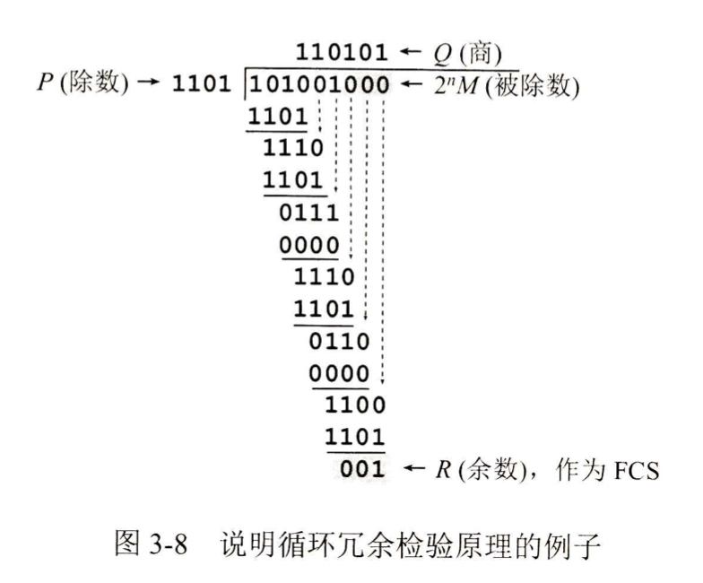
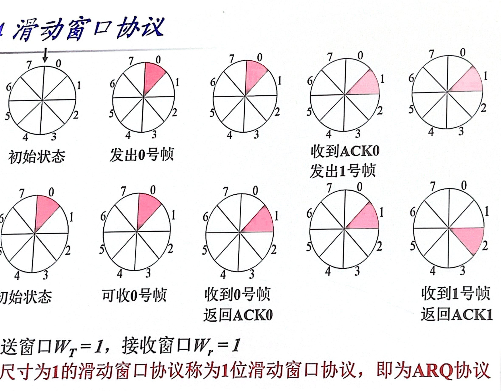
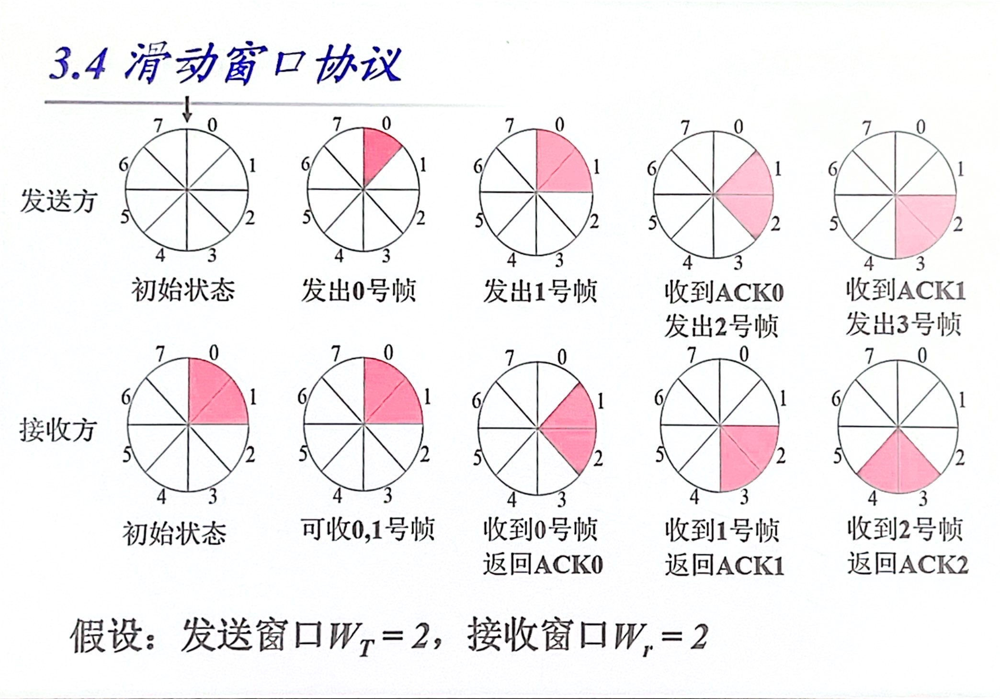
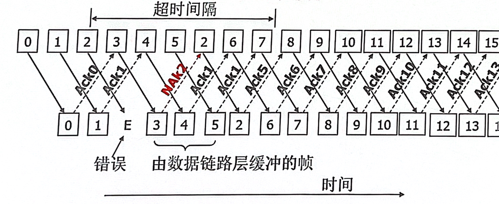
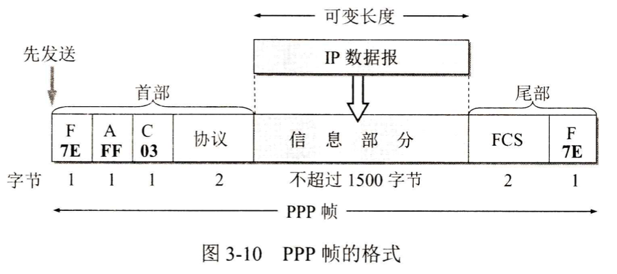
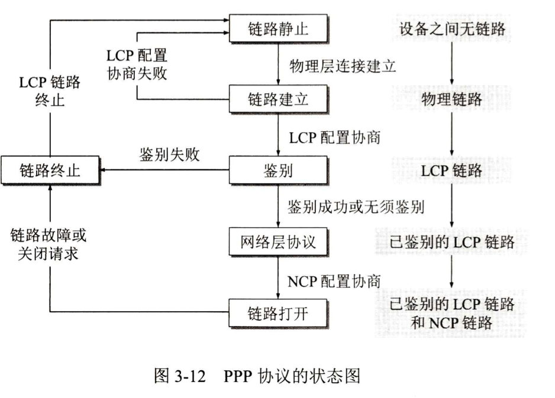

# 數據鏈路層

## 概述

數據鏈路層在物理層的基礎上實現幀的傳輸，傳輸的協議數據單元PDU是幀

使用的信道類型：點對點信道(一對一)、廣播信道(一對多)

### 需要考慮的問題

成幀：怎麼組成幀、怎麼使得接收方識別幀

差錯控制：幀在傳輸過程中的出錯檢測

流量控制及可靠傳輸：數據鏈路層的選項

廣播信道中的介質訪問控制

### 成幀方法

字符計數法：在幀頭部字段中表明本幀的字節數，接收方通過次得知接收多少字節

字符填充的首尾定界法：定義專門的字符作為幀開始和結束的標誌，使用字符填充的方式將標誌字符與數據區分開來

比特填充的首尾定界法：定義專門的比特序列作為幀的開始和結束標誌，並使用比特填充方式將標誌序列和數據區分開來

物理編碼違例法：使用無效的物理編碼作為幀開始和結束的標誌

## 錯誤檢測月與糾正

誤碼率BER = 出錯的比特旅 / 傳送的比特數

處理方法：使用可檢測並糾正錯誤的編碼(糾錯碼)，使用可檢測錯誤的編碼+重傳(檢錯碼)

#### 常見的檢錯編碼方式

奇偶校驗

簡單累加和

循環冗余校驗CRC

使用生成多項式P(X)表示除數P

CRC-16：P(X) = X16+X15+X2+1

CRC-CCITT：P(X) = X16+X12+X2+1

CRC-32

網絡中具體實現時，通常採用硬件電路生成

#### 糾錯編碼 Error Correcting Code

通過增加冗余信息使得能夠檢測錯誤發生所在便與糾正，稱為前向糾錯。例如海明編碼。

## 基本數據鏈路協議

### 無限制的單工協議

前提：單向傳輸、理想信道、發送方總有數據發送、接收方總能及時處理所收到的數據。

未考慮接收方的處理速度，設想 發送方發送 > 接收方處理

### 單工停-等協議

按照“無限制的單工協議”，如果接收方處理幀的速度不及發送方，則幀可能丟失

增加流量控制，得到單工停等協議：接收方每收到一個幀都向發送方返回一個應答幀；發送方每發送一個幀都等待來自接收方的應答幀之後再發送下一個幀

未考慮傳輸錯誤

### 有噪聲信道的單工協議

#### ARQ協議 Automatic Repeat reQuest

校驗和：使接收方能夠檢測幀是否出錯

確認幀：使發送方知道幀已被正確接收

超時重發：發送方在規定時間內未收到正確幀，則重發幀

幀序號：保證接收方不會重複接受幀

#### 考慮三種情況

數據幀被正確接收：接收方返回確認幀，發送方接收後繼續發送下一幀

數據幀出錯或丟失：接收方未收到幀或校驗出錯丟棄該幀，發送方等待確認幀超時後重發數據幀

數據幀出錯或丟失：發送方發出數據幀後接收方未發送接收幀，發送方超時後不得不重發數據幀，接收方檢驗碼無法匹配該幀

## 滑动窗口协议

ARQ協議的信道利用率太低，尤其當傳輸時延太長時

U = TD / (TD+RTT+TA)

TD 發送數據幀的時間

RTT 往返時延/環路時延

TA 發送應答幀的時間

滑動窗口協議的**基本思想**：允許發送方連續發送多個幀，通過滑動窗口實現流量控制

**發送方**：發送窗口內的序列號代表允許它發送的幀

窗口上邊界：窗口內最大的序列號稱為窗口上邊界/上沿/前沿

窗口下邊界：窗口內最小的序列號稱為窗口下邊界/下沿/後沿

從網絡層得到一個數據報組裝成幀發出後窗口+1，發送窗口下邊界的幀被接收方確認後下邊界+1

**接收方**：接受窗口內的序列號代表它可以接收的幀

收到的序列號等於窗口下邊界時，將該幀上交網絡層，返回確認幀，同時整個窗口向前移動1個位置

如果收到幀序列號落在接受窗口之外，則將其丟棄。

**Attention**：接受窗口總是保持固定大小

連續發送的多個幀中某一個幀出錯或丟失，但後續幀已被正確接收，如何處理？

方案一：出错幀后的幀丟弃，从出錯幀開始重新發送 -> 後退N幀

方案二：出错幀后的幀保留，只重发出错帧 -> 選擇性重傳

## 選擇性重傳的滑動窗口協議

· 某幀出錯時，只選擇性的重發該幀，之後發送的幀由接收方數據鏈路層緩衝，收到重發的出錯幀後上交到網絡層。

· 接收方監測到出錯幀時，發送一個否認的確認

ACKn表示n以及n以前的幀均已被正確接收

## 點對點協議PPP

一種數據鏈路層協議，廣泛應用到點對點鏈路的數據傳輸

### 幀格式

標誌字段F：=0x7E

地址字段A：置為0xFF，實際上不起作用

控制字段C：通常設置為0x03

協議字段：2字節，用於識別信息字段類型(載荷payload)

	- 0x0021：PPP幀的信息字段是IP數據報
	- 0xC021：信息字段是PPP鏈路控制數據(LCP)
	- 0x8021：信息字段是網絡控制數據(NCP)

校驗字段FCS：2字節的CRC校驗

### 透明傳輸問題

同步傳輸：零比特填充

異不傳輸：字符填充

#### 字符填充

 - 把信息字段中出现的每一个0x7E字节转变成为2字节序列(0x7D, 0x5E)。

 - 若信息字段中出现一个0x7D 的宇节(即出现了和转义字符一样的比特组合)，则
   把0x7D转变成为2字节序列(0x7D, 0x5D)。

 - 若信息字段中出现 ASCII 码的控制字符(即数值小于0x20的字符)，则在该字符前
   面要加入一个0x7D字节，同时将该字符的编码加以改变。

   例如，出现0x03(在控制字符中是“传输结束”ETX)就要把它转变为2字节序列(0x7D, 0x23)。

由于在发送端进行了字节填充，因此在链路上传送的信息字节数就超过了原来的信息字节数。但接收端在收到数据后再进行与发送端字节填充相反的变换，就可以正确地恢复出原来的信息。

#### 零比特填充

發送端：只要發現連續5個1，立刻填入一個0

接收端：收到一個幀後先找到標誌字段F以確定一個幀邊界，接著用硬件對其中的比特流進行掃描。每發現5個連續的1時，就把這5個連續1後面的一個0刪除，還原成原來的比特流。

### 工作狀態

#### 身份認證協議

	- PAP Password Authentication Protocol
	- CHAP Challenge-Handshake Authentication Protocol
