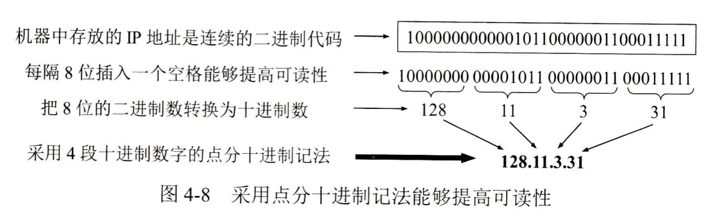
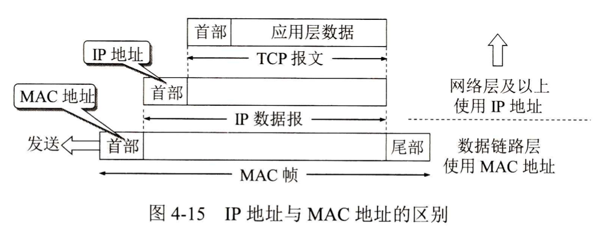
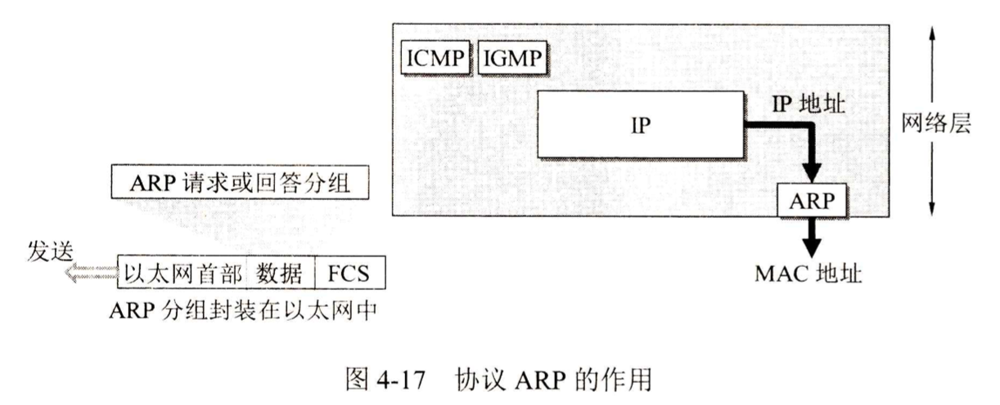
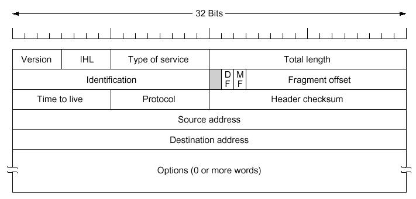
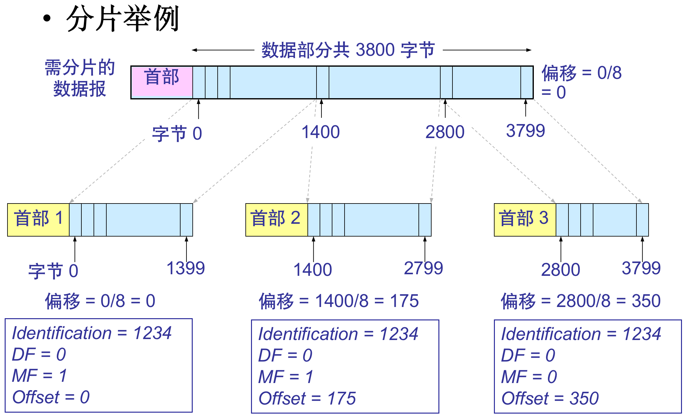
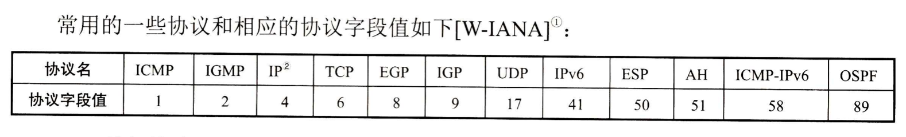
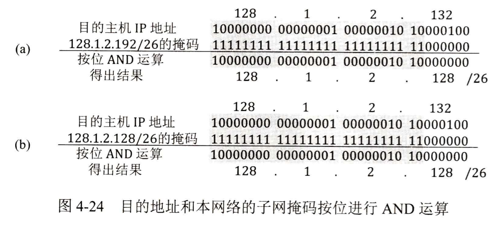

# 網絡層

## 網絡層提供的兩種服務

面向連接or無連結

面向連結的服務，即虛電路：開始傳輸之前先建立網絡連結，之後的數據均通過該連結進行，由網絡保證數據傳輸的可靠性

無連接的服務，即數據報：發送數據時不需要先建立一個連接，每一個分組在網絡中獨立傳輸，網絡層不保證服務質量。

TCP/IP採用數據報服務。

## 網際協議IP

與IP配套的使用的四個協議：ARP、RARP、ICMP、IGMP

IPv4：32位IP地址，分配由ICANN負責

A類地址：8-net_id + 24-host_id

B類地址：16-net_id + 16-host_id

C類地址：110開頭的24-net_id + 8-host_id

IP地址的表示方式：點分十進制記法（全0，全1有特殊含義）

### IP地址與網絡硬件

#### IP地址

網絡層以及以上各層使用的地址，是一種邏輯地址 存放在IP包頭部

#### 物理地址

數據鏈路層及物理層使用的地址

存放在數據鏈路層的幀中

#### ARP協議

地址解析協議，將一個MAC地址映射到IP地址

主機設有一個ARP高速緩存 ARP cache，存有本地局域網上各主機和路由器的IP地址與硬件地址映射表

当主机 A 欲向本局域网上的主机B发送IP包时：

- 先在其ARP高速缓存中查看有无主机B的IP地址
- 如有，就可查出其对应的硬件地址，再将此硬件地址写入MAC帧，通过局域网发送
- 如无，则在网络中广播一个ARP请求
- 当主机B收到ARP请求后，向主机A返回一个ARP应答，告知自己的物理地址

## IP數據報格式

源地址和目的地址都是IP協議

一個IP包由頭部和數據兩部分構成

頭部：20字節的固定字段+0到多個可選字段

- Version：4bit，IP 协议的版本，目前的 IP 协议版本号为 4  (即 IPv4)
- IHL：4bit，IP包头长度，最小5，最大15，单位为word(32bit)。因此 IP包头最长60 字节
- Type of service：1字节，服务类型，目前很多路由器忽略该字段
- Total Length：2字节，IP包总长度(含头部和数据)，单位为字节。因此IP包的最大长度为 65535 字节
- Identification：2字节，标识，是一个计数器，用来产生IP包的标识
  - 超过数据链路层MTU(Maximum Transmission Unit)的IP包要分片传输
  - 分片的多个包具有相同的标示，便于接收端重组

- DF：1bit，Don’t Fragment，当 DF=0 时允许分片
- MF：1bit，More Fragment，MF=1表示后面“还有分片”；MF=0表示最后一个分片
- Fragment offset：13bit，片偏移，较长的包在分片后，某片在原分组中的相对位置，以8字节为单位
- Time to live(TTL)：1字节，生存时间，IP包在网络中可通过的路由器个数的最大值
  - 实际实现中，IP包每经过一个路由器TTL减1，为0则丢弃，并向源主机发送一个告警包
  - 最大值为255，由源主机设定初始值，Windows操作系统一般为128，UNIX操作系统一般为255，Linux一般为64
- Protocol：8bit，协议字段，该包中数据部分的协议类型，即上层协议类型  该字段决定了该包将交由哪里

- Header checksum：2字节，包头校验和(注意：只针对包头)
- Source address：4字节，源IP地址
- Destination address：4字节，目的IP地址
- 选项字段：以4字节为单位，最长40字节。实际网络中很少使用

### 校驗和算法

對IP包頭，每16位求反循環相加（進位加在末尾），和再求反

## 劃分子網和構造超網

### 劃分子網

分類IP地址無法適應Internet快速發展的需要 -> 劃分子網

子網掩碼是一個網絡或一個子網的重要屬性，在路由尋址中發揮著重要作用

對目的IP地址和子網掩碼執行“按位與”運算，即可得到子網地址

### 使用子網掩碼的分組轉發過程

路由器中的路由表包含三個基本信息：目的網絡地址、子網掩碼、下一跳地址

转发流程：
	- 从收到的分组的首部提取目的IP地址D
	- 先用与该路由器直接相连各网络的子网掩码和D逐位相“与”，看是否和相应的网络地址匹配，若匹配，则将分组直接交付；否则就是间接交付，执行下一条
	- 若路由表中有目的地址为D的特定主机路由，则将分组传送给指明的下一跳路由器；否则执行下一条
	- 对路由表中的每一行的子网掩码和 D 逐位相“与”，若其结果与该行的目的网络地址匹配，则将分组传送给该行指明的下一跳路由器；否则执行下一条
	- 若路由表中有一个默认路由，则将分组传送给路由表中所指明的默认路由器；否则执行下一条
	- 报告转发分组出错

核心操作：将目的IP地址与路由表中子网掩码“与”，并判断是否与目的网络匹配

### 無分類編址CIDR

CIDR的主要特点
- 消除传统A类、B类和C类地址以及划分子网的概念

- 使用各种长度的“网络前缀”(network-prefix)来代替分类地址中的网络号和子网号

- IP地址从三级编址(使用子网掩码)又回到了两级编址

  IP地址 ::= {<网络前缀>, <主机号>} 

- CIDR还使用“斜线记法”(slash notation)，又称为CIDR记法
  IP地址后加一个斜线“/”，后跟网络前缀所占的位数

例：128.14.35.7/20 表示该地址的高20位是网络前缀

网络前缀都相同的连续的 IP 地址组成“CIDR地址块”。
例：128.14.32.0/20表示的CIDR地址块共有212个地址，128.14.32.0～128.14.47.255

#### 路由聚合

一个 CIDR 地址块可以表示很多地址，这种地址的聚合称为路由聚合(构成超网)

路由聚合的好处：路由表中的一个项目可以表示很多个(例如上千个)原来传统分类地址的路由，可以减少路由表中表项个数，并减少路由器间交换的路由信息量

#### 最长前缀匹配

使用CIDR时，路由表中的表项中的“目的网络地址”由固定长度变成了变长的“网络前缀”
在查找路由表时可能会得到不止一个匹配结果

##### 最长前缀匹配(longest-prefix matching)原则

	- 从匹配结果中选择具有最长网络前缀的路由
	- 网络前缀越长，其地址块就越小，因而路由就越具体(more specific)
	- 最长前缀匹配又称为最长匹配或最佳匹配