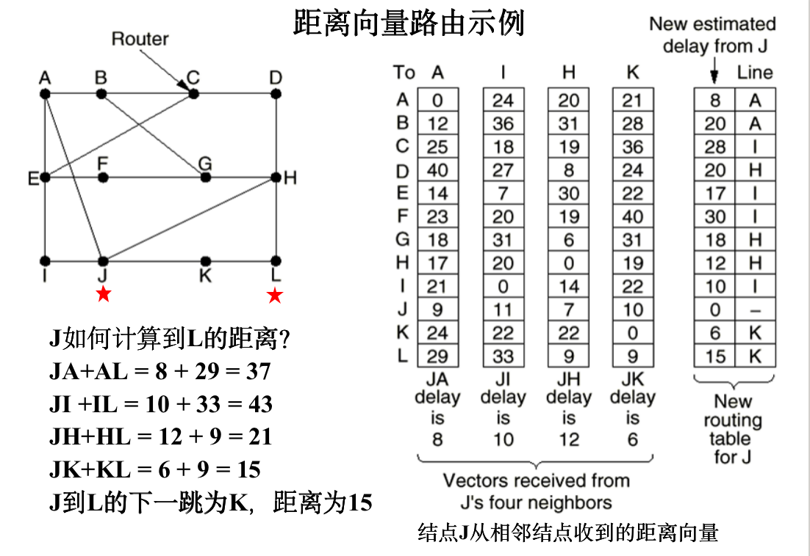
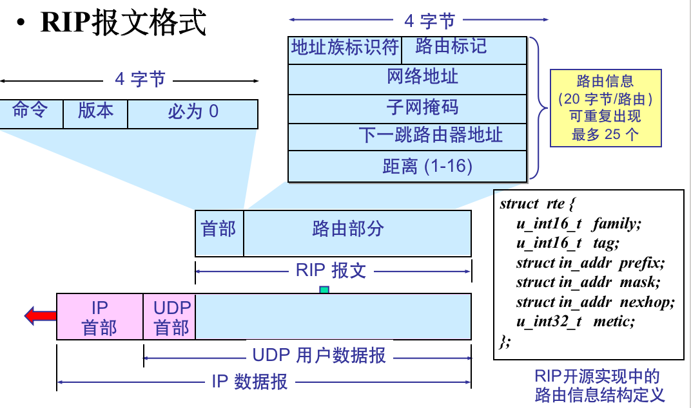

# 網絡層

## 網絡層提供的兩種服務

面向連接or無連結

面向連結的服務，即虛電路：開始傳輸之前先建立網絡連結，之後的數據均通過該連結進行，由網絡保證數據傳輸的可靠性

無連接的服務，即數據報：發送數據時不需要先建立一個連接，每一個分組在網絡中獨立傳輸，網絡層不保證服務質量。

TCP/IP採用數據報服務。

## 網際協議IP

與IP配套的使用的四個協議：ARP、RARP、ICMP、IGMP

IPv4：32位IP地址，分配由ICANN負責

A類地址：8-net_id + 24-host_id

B類地址：16-net_id + 16-host_id

C類地址：110開頭的24-net_id + 8-host_id

IP地址的表示方式：點分十進制記法（全0，全1有特殊含義）

### IP地址與網絡硬件

#### IP地址

網絡層以及以上各層使用的地址，是一種邏輯地址 存放在IP包頭部

#### 物理地址

數據鏈路層及物理層使用的地址

存放在數據鏈路層的幀中

#### ARP協議

地址解析協議，將一個MAC地址映射到IP地址

主機設有一個ARP高速緩存 ARP cache，存有本地局域網上各主機和路由器的IP地址與硬件地址映射表

当主机 A 欲向本局域网上的主机B发送IP包时：

- 先在其ARP高速缓存中查看有无主机B的IP地址
- 如有，就可查出其对应的硬件地址，再将此硬件地址写入MAC帧，通过局域网发送
- 如无，则在网络中广播一个ARP请求
- 当主机B收到ARP请求后，向主机A返回一个ARP应答，告知自己的物理地址

## IP數據報格式

源地址和目的地址都是IP協議

一個IP包由頭部和數據兩部分構成

頭部：20字節的固定字段+0到多個可選字段

- Version：4bit，IP 协议的版本，目前的 IP 协议版本号为 4  (即 IPv4)
- IHL：4bit，IP包头长度，最小5，最大15，单位为word(32bit)。因此 IP包头最长60 字节
- Type of service：1字节，服务类型，目前很多路由器忽略该字段
- Total Length：2字节，IP包总长度(含头部和数据)，单位为字节。因此IP包的最大长度为 65535 字节
- Identification：2字节，标识，是一个计数器，用来产生IP包的标识
  - 超过数据链路层MTU(Maximum Transmission Unit)的IP包要分片传输
  - 分片的多个包具有相同的标示，便于接收端重组

- DF：1bit，Don’t Fragment，当 DF=0 时允许分片
- MF：1bit，More Fragment，MF=1表示后面“还有分片”；MF=0表示最后一个分片
- Fragment offset：13bit，片偏移，较长的包在分片后，某片在原分组中的相对位置，以8字节为单位
- Time to live(TTL)：1字节，生存时间，IP包在网络中可通过的路由器个数的最大值
  - 实际实现中，IP包每经过一个路由器TTL减1，为0则丢弃，并向源主机发送一个告警包
  - 最大值为255，由源主机设定初始值，Windows操作系统一般为128，UNIX操作系统一般为255，Linux一般为64
- Protocol：8bit，协议字段，该包中数据部分的协议类型，即上层协议类型  该字段决定了该包将交由哪里

- Header checksum：2字节，包头校验和(注意：只针对包头)
- Source address：4字节，源IP地址
- Destination address：4字节，目的IP地址
- 选项字段：以4字节为单位，最长40字节。实际网络中很少使用

### 校驗和算法

對IP包頭，每16位求反循環相加（進位加在末尾），和再求反

## 劃分子網和構造超網

### 劃分子網

分類IP地址無法適應Internet快速發展的需要 -> 劃分子網

子網掩碼是一個網絡或一個子網的重要屬性，在路由尋址中發揮著重要作用

對目的IP地址和子網掩碼執行“按位與”運算，即可得到子網地址

### 使用子網掩碼的分組轉發過程

路由器中的路由表包含三個基本信息：目的網絡地址、子網掩碼、下一跳地址

转发流程：
	- 从收到的分组的首部提取目的IP地址D
	- 先用与该路由器直接相连各网络的子网掩码和D逐位相“与”，看是否和相应的网络地址匹配，若匹配，则将分组直接交付；否则就是间接交付，执行下一条
	- 若路由表中有目的地址为D的特定主机路由，则将分组传送给指明的下一跳路由器；否则执行下一条
	- 对路由表中的每一行的子网掩码和 D 逐位相“与”，若其结果与该行的目的网络地址匹配，则将分组传送给该行指明的下一跳路由器；否则执行下一条
	- 若路由表中有一个默认路由，则将分组传送给路由表中所指明的默认路由器；否则执行下一条
	- 报告转发分组出错

核心操作：将目的IP地址与路由表中子网掩码“与”，并判断是否与目的网络匹配

### 無分類編址CIDR

CIDR的主要特点
- 消除传统A类、B类和C类地址以及划分子网的概念

- 使用各种长度的“网络前缀”(network-prefix)来代替分类地址中的网络号和子网号

- IP地址从三级编址(使用子网掩码)又回到了两级编址

  IP地址 ::= {<网络前缀>, <主机号>} 

- CIDR还使用“斜线记法”(slash notation)，又称为CIDR记法
  IP地址后加一个斜线“/”，后跟网络前缀所占的位数

例：128.14.35.7/20 表示该地址的高20位是网络前缀

网络前缀都相同的连续的 IP 地址组成“CIDR地址块”。
例：128.14.32.0/20表示的CIDR地址块共有212个地址，128.14.32.0～128.14.47.255

#### 路由聚合

一个 CIDR 地址块可以表示很多地址，这种地址的聚合称为路由聚合(构成超网)

路由聚合的好处：路由表中的一个项目可以表示很多个(例如上千个)原来传统分类地址的路由，可以减少路由表中表项个数，并减少路由器间交换的路由信息量

#### 最长前缀匹配

使用CIDR时，路由表中的表项中的“目的网络地址”由固定长度变成了变长的“网络前缀”
在查找路由表时可能会得到不止一个匹配结果

##### 最长前缀匹配(longest-prefix matching)原则

- 从匹配结果中选择具有最长网络前缀的路由
- 网络前缀越长，其地址块就越小，因而路由就越具体(more specific)
- 最长前缀匹配又称为最长匹配或最佳匹配

## 網際控制報文協議ICMP

## 路由算法及協議

路由器一局路由信息轉發分組，路由信息是路由協議生成的，路由算法是路由協議的基礎和核心。路由協議是用來聲稱路由信息的，不是轉發分組的。

理想路由算法的特性：

	- 正確的，完整的：按照得出的路由能夠進行正確尋址
	- 在計算上應該簡單，不增加過多的開銷
	- 有自適應性，能根據通信量和網絡拓撲的變化調整路由
	- 具有穩定性，通信量和拓撲穩定時能快速收斂
	- 應該是公平的，對所有用戶公平
	- 應該是最佳的，能找出最好的路由（時延最小、吞吐量最大）

不存在絕對最佳的路由算法

### 靜態路由與動態路由

#### 靜態路由選擇策略

非自適應路由選擇，簡單且開銷較小但不能及時適應網絡變化

#### 動態路由選擇策略

自適應路由選擇，較好適應網絡狀態變化，實現起來較為複雜，開銷較大，適用於較大規模、頻繁變化的網絡，通過專門算法和協議進行路由計算。

距離向量路由算法、鏈路狀態路由算法

### 自治系統

在单一的技术管理下的一组路由器，而这些路由器使用一种 AS 内部的路由选择协议和共同的度量以确定分组在该 AS 内的路由，同时还使用一种 AS 之间的路由选择协议用以确定分组在 AS之间的路由

#### 內部網關協議IGP

这类路由协议使用得最多，如 RIP 和 OSPF 协议

#### 外部網關協議EGP

若源站和目的站处在不同的自治系统中，当数据报传到一个自治系统的边界时，就需要使用一种协议将路由选择信息传递到另一个自治系统中，这样的协议就是外部网关协议 EGP。

### 距離向量路由和RIP協議

動態路由算法，也称为Bellman-Ford路由算法和Ford-Fulkerson算法，最初用於ARPANET，被RIP協議採用

#### 基本思想

	- 每个路由器维护一张表，表中给出了到每个目的地的已知最佳距离和线路，并通过与相邻路由器交换距离信息来更新表
	- 路由器周期性地向所有相邻路由器发送它的距离表，同时它也接收每个邻居结点发来的距离表；
	- 相邻路由器X发来的表中，X到路由器i的距离为Xi，本路由器到X的距离为m，则路由器经过X到i的距离为Xi + m。根据不同邻居发来的信息，计算Xi + m，并取最小值，更新本路由器的路由表

算法缺陷：對好消息反應迅速，對壞消息反應遲鈍

### RIP(Routing Information Protocol)协议

属于距离向量路由协议，简单，适用于小规模网络中的路由

RIP中的距离定义：路由器跳数(hop count)
	- 最长距离15，即允许的最长路径中最多包含15个路由器
	- 距离为16表示不可达
	- 直接连接的距离为0

RIP的三个要点
	- 仅和相邻路由器交换信息
	- 交换的信息是当前本路由器所知道的全部信息，即自己的路由表
	- 按固定的时间间隔交换路由信息(典型值：每隔 30 秒)

#### RIP報文格式

#### 收到相邻路由器发来RIP报文后的处理流程

	- 先修改此 RIP 报文中的所有项目：把“下一跳”字段中的地址都改为 X，并把所有的“距离”字段的值加 1。每个项目有三个关键数据：目的网络N、距离d、下一跳路由器X。
 - 对修改后的 RIP 报文中的每一个项目，重复以下步骤：
   若路由表中没有目的网络N，则把该项目加到路由表中。
       否则
          若下一跳字段给出的路由器地址是X，则用收到的项目替换原有项目。
          否则 
              若收到项目中的距离d小于路由表中的距离，则进行更新，
   	否则，什么也不做。
	- 若 3 分钟还没有收到相邻路由器的更新路由表，则把此相邻路由器记为不可达路由器，即将距离置为16（距离为16表示不可达）。
	- 返回。

### 链路状态路由与OSPF协议

#### 基本思想

每個路由器完成5步工作：

	- 發現它的鄰居結點，並學習其網絡地址
	- 測量到各鄰居結點的延遲和開銷
	- 構造一個分組，其中包含所有它剛剛知道的信息
	- 將這個分組發送給其他所有路由器
	- 計算出到每一個其他路由器的最短路徑

個路由器之間動態交換鏈路狀態信息，每個路由器都建立一個鏈路狀態數據庫

	- “鏈路狀態” 本路由器都和哪些路由器相鄰，以及該鏈路的“度量”

鏈路狀態數據庫實際上是全網的拓撲結構圖，在全網範圍內是一致的

個路由器根據網絡拓撲使用Djikstra算法計算從本路由器到其他結點的最佳路徑，構成路由表

#### OSPF協議

屬於鏈路狀態路由協議

收斂速度快，當鏈路狀態發生變化時，結點會以洪泛方式告知所有網絡中其他所有結點

	- 洪泛(flooding): 结点收到分组时，向除输入链路外的所有其他链路发送出去

適用於較大規模網絡，僅在鏈路狀態發生變化時發送洪泛信息，不會產生很大的通信量

OSPF將一個自治系統劃分為若干個區域，每一個區域有一個32位的區域標識符，用點分十進制表示。利用洪泛法交换链路状态信息的范围局限于一个区域而不是整个的自治系统，减少了整个网络上的通信量。

##### 5种分组

类型1：Hello分组

类型2：Database Description分组

类型3：Link State Request分组

类型4：Link State Update分组，用洪泛法对全网更新链路状态

类型5：Link State Acknowledgment分组

#### 外部網關路由協議BGP

不同自治系統的路由器之間交換路由信息的協議

