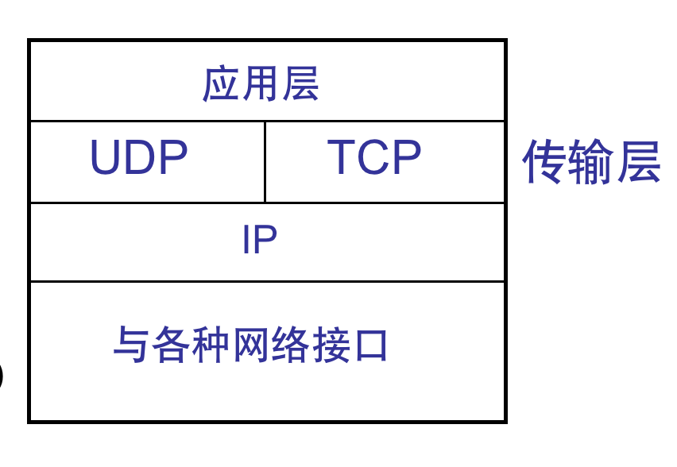

# 傳輸層

## 概述

傳輸層又叫運輸層，向他上面的應用層提供通信服務

網絡層實現主機之間的邏輯通信，傳輸層實現應用進程之間的邏輯通信(復用和解分)

傳輸層協議：TCP協議、UDP協議

### TCP协议

可靠传输协议

提供面向连接的服务

	- 传送数据前要先建立连接，传送结束后释放连接
	- 需进行确认、流量控制、计时器、连接管理等，处理开销较大
	- 基于TCP的典型应用协议：HTTP、FTP、…

### UDP协议

不可靠传输协议

传送数据时无需建立连接

与TCP相比，效率更高，但可能出现数据错、丢包、顺序错等问题

基于UDP的典型应用协议：DNS、RIP、…