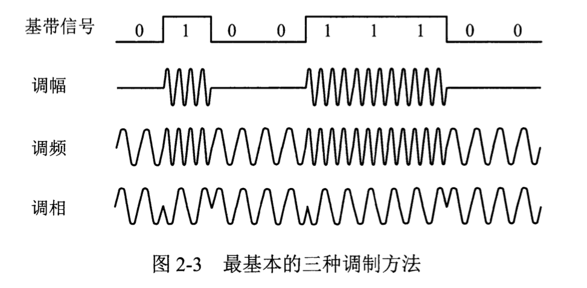
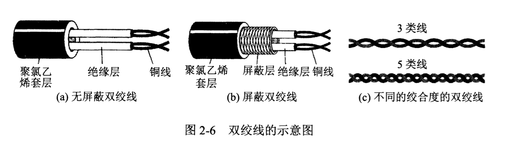

# 物理層

主要任務：在介質上傳輸比特流

四個特性：機械特性(接線器形狀與尺寸，引線數目排列...)、電氣特性(電壓範圍)、功能特性(某一電平的電壓的意義)、過程特性(不同功能的各種可能事件的意義)

## 數據通信基礎知識

### 通信模型

(輸入漢字) -> PC機 -> (數字比特流) -> 調製解調器 -> (模擬信號) -> (公用電話網) -> (模擬信號) -> 調製解調器 -> (數字比特流) -> PC機 -> (顯示漢字)

信道：向某一方向傳輸信息的介質，通信的目的是傳送消息，消息的實體是數據，信號是數據的電氣/電磁表現。

時域中代表不同離散數值的基本波形為碼元，單位時間內通過信道的碼元個數為碼元速率(波特)，單位時間內通過信道的信息量為數據速率(bps) -> 期望一個碼元攜帶盡可能多的比特

### 信號的概念

· 通信雙方的交互方式：單向通信，雙向交替通信，雙向同時通信

· 基帶信號是來自信源的信號，是計算機輸出的代表各種文件或圖像的數據信號，在物理世界中基本無法直接傳輸；帶通信號是經過基本調製的信號，可以直接傳輸

·二元製調製方法：調幅(AM)，調頻(FM)，調相(PM) -> 常採用多元調製的方式

信號失真：碼元傳輸速率越高，信號傳輸越遠，失真越嚴重。有失真但可識別。

Nyquist定理：理想低通信道最大數據傳輸率 = 2 H log2V bps

信噪比：10 log10(S / N) dB

Shannon公式：信道的極限信息傳輸速率 C=W log2(1 + S / N) b/s	W信道帶寬，S信道內信號平均功率，N信道內高斯噪聲功率

## 物理層下的傳輸介質

傳輸介質：導引型傳輸介質，非導引型傳輸介質

雙絞線：10Mbps～10Gbps，STP屏蔽雙絞線(銅網屏蔽層)，UTP無屏蔽雙絞線

同軸電纜：數十Mbps，用作導引型共享媒體

光纖通信：每個脈衝表示一個比特，數十～數百Gbps，不受電磁干擾，長途導引型傳輸媒體 (跨海鏈路)
